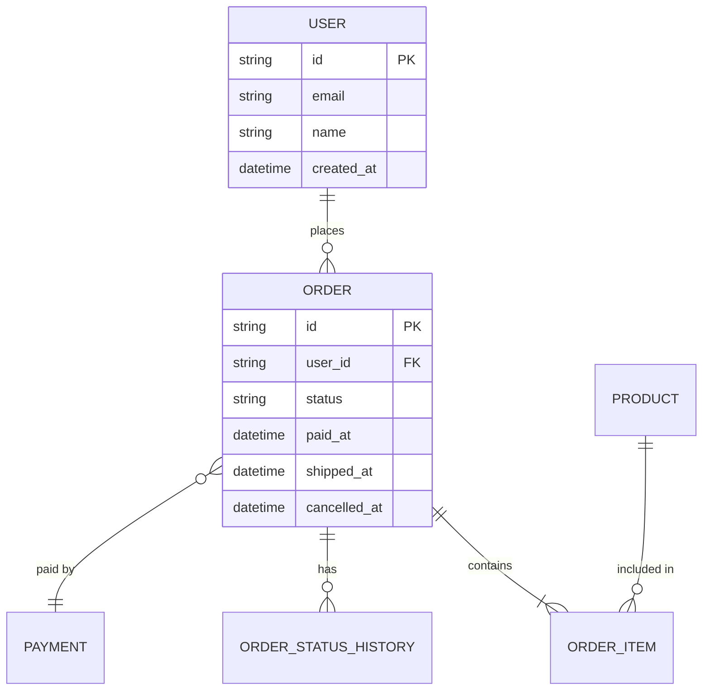

# How I use AI to modernize legacy projects without breaking anything


We've all inherited that project. The one nobody wants to touch. The one with 500-line functions, no tests, no documentation, and that somehow works in production.

Before, refactoring something like that was a gamble: you prayed not to break anything and crossed your fingers on every deploy. Now, with AI as a copilot, the process is different. Not magical, but safer and more methodical.

I've been using this approach on real projects for a while and I want to share the methodology that has worked for me.

---

## The most common mistake: starting to refactor directly

The temptation is strong. You see that spaghetti code and you want to fix it now. But without understanding the business and without tests, you're walking blind.

I've seen (and made) this mistake: you refactor something that "clearly is wrong," only to discover that weird behavior was intentional and half the system depended on it.

AI amplifies both your successes and your mistakes. If you don't know what the code does, AI won't guess it either.

---

## Step 1: Document the business first

Before touching a single line of code, you need to understand what the system does. Not the _how_ (you see that in the code), but the _what_ and the _why_.

If there's no documentation, create it. And here AI is tremendously useful.

### How I do it

I don't start with the code. I start with the database.

The data model tells the business story better than any code. Tables, relationships, fields... all of that reflects business decisions someone made at some point.

I pass the database schema to AI and ask for reverse engineering:

```
Analyze this database schema and explain:
1. What business entities it represents
2. How they relate to each other
3. What business rules you can infer from constraints and fields
4. What likely business flows exist
5. Generate an entity-relationship diagram in Mermaid format

[tables/collections schema]
```

AI generates something like this:



You include this diagram directly in your markdown documentation and it renders automatically. It's gold for understanding the system at a glance.

For example, if you see an `orders` table with fields like `status`, `paid_at`, `shipped_at`, `cancelled_at`, you already know there's an order status flow. If there's an `order_status_history` table, you know they need audit trails for status changes.

Once I understand the data model, I move to the code. I pass sections of code and ask it to explain the business logic:

```
Analyze this controller and explain:
1. What business process it represents
2. What business rules are implicit in the code
3. What edge cases it's handling
4. What external dependencies it has

[controller code]
```

The combination of data model + code gives you a much more complete picture than either one alone.

AI doesn't always get it 100% right, but it gives you a starting point to validate with the team or stakeholders.

### The deliverable

A markdown document with:

- General module description
- Main business flows
- Identified business rules
- Dependencies and integrations
- Special cases or exceptions

This document has a dual purpose: it helps you now and helps future developers later.

---

## Step 2: Create tests before refactoring

This is the golden rule: **never refactor code without tests that validate the current behavior**.

I'm not talking about perfect unit tests with mocks for everything. I'm talking about tests that capture the real system behavior, including the database.

### My approach: integration tests with a real database

In a recent project with MongoDB without domain classes (direct queries everywhere), trying to mock was impossible. The logic was so coupled to the document structure that any mock would be a lie.

The solution was to create integration tests with a real test database:

```typescript
// test/integration/users/get-user-by-id.e2e-spec.ts
describe('UserController - getUserById', () => {
  let app: INestApplication
  let testDb: TestDatabase

  beforeAll(async () => {
    testDb = await TestDatabase.create()
    app = await createTestApp(testDb)
  })

  afterAll(async () => {
    await testDb.cleanup()
    await app.close()
  })

  beforeEach(async () => {
    await testDb.clear()
  })

  it('should return user when exists', async () => {
    // Arrange
    const userId = await testDb.insertUser({
      name: 'John Doe',
      email: 'john@example.com',
      status: 'active',
    })

    // Act
    const response = await request(app.getHttpServer())
      .get(`/users/${userId}`)
      .expect(200)

    // Assert
    expect(response.body).toMatchObject({
      name: 'John Doe',
      email: 'john@example.com',
      status: 'active',
    })
  })

  it('should return 404 when user does not exist', async () => {
    const fakeId = new ObjectId().toString()

    await request(app.getHttpServer()).get(`/users/${fakeId}`).expect(404)
  })
})
```

### Tests per method, not per controller

An important tip: create one test file per controller method, not one giant file for the whole controller.

Why?

- **Easier to debug**: if something fails, you know exactly where
- **Easier to create incrementally**: you can add tests one by one
- **Easier to maintain**: each file has a clear scope

The structure looks like this:

```
test/
  integration/
    users/
      get-user-by-id.e2e-spec.ts
      create-user.e2e-spec.ts
      update-user.e2e-spec.ts
      delete-user.e2e-spec.ts
      list-users.e2e-spec.ts
```

### Use AI to generate the tests

This is where AI shines. I pass the method code and ask:

```
Generate integration tests for this method.
Include:
- Success case
- Error cases (not found, validation, etc.)
- Edge cases you see in the code

Use this format: [test example]
The database is MongoDB, use TestDatabase to insert test data.
```

Review what it generates, adjust for your context, and run it against the real system to validate.

---

## Step 3: Refactor with the safety net

Now yes, with documentation and tests in place, you can start refactoring.

### Order matters

Don't try to refactor everything at once. This is the order that has worked for me:

**1. Extract the data layer first**

Create well-defined repositories by responsibility:

```typescript
// Before: direct query in the controller
const user = await this.db.collection('users').findOne({ _id: userId })

// After: dedicated repository
const user = await this.userRepository.findById(userId)
```

Each repository should have a single responsibility. If you have a `UserRepository` that also handles roles and permissions, split it.

**2. Extract business logic to services**

Once the data is encapsulated, extract the logic to specialized services:

```typescript
// Before: everything in the controller
@Get(':id')
async getUser(@Param('id') id: string) {
  const user = await this.db.collection('users').findOne({ _id: id })
  if (!user) throw new NotFoundException()

  const permissions = await this.db.collection('permissions')
    .find({ userId: id }).toArray()

  return {
    ...user,
    permissions: permissions.map(p => p.name),
    isAdmin: permissions.some(p => p.name === 'admin')
  }
}

// After: separated into services
@Get(':id')
async getUser(@Param('id') id: string) {
  return this.userFacade.getUserWithPermissions(id)
}
```

**3. Convert the controller into a facade**

The controller (or the main service if you use that pattern) becomes an orchestrator that delegates to specialized services:

```typescript
// user.facade.ts
@Injectable()
export class UserFacade {
  constructor(
    private readonly userService: UserService,
    private readonly permissionService: PermissionService,
    private readonly notificationService: NotificationService
  ) {}

  async getUserWithPermissions(id: string): Promise<UserWithPermissionsDto> {
    const user = await this.userService.findById(id)
    const permissions = await this.permissionService.getForUser(id)

    return {
      ...user,
      permissions: permissions.map((p) => p.name),
      isAdmin: permissions.some((p) => p.name === 'admin'),
    }
  }
}
```

I use the `Facade` suffix to make it clear that it's just an orchestrator, not where the real logic lives.

### Update tests as you add dependencies

Every time you extract a new dependency, you need to add it to the tests. A tip: create a helper that groups the test module configuration:

```typescript
// test/helpers/create-test-module.ts
export async function createUserTestModule(testDb: TestDatabase) {
  return Test.createTestingModule({
    imports: [
      /* common imports */
    ],
    controllers: [UserController],
    providers: [
      UserFacade,
      UserService,
      PermissionService,
      UserRepository,
      PermissionRepository,
      { provide: 'DATABASE', useValue: testDb.getConnection() },
    ],
  }).compile()
}
```

This way when you add a new dependency, you only add it in one place.

---

## Step 4: Refactor the tests

Once the code is clean and everything works, it's time to clean up the tests.

During refactoring, tests probably ended up with duplicate code, improvised helpers, and inconsistent structures. Now is the time to organize them.

**Important**: refactor the tests without changing their functionality. Tests should continue to validate exactly the same things, just with cleaner code.

This includes:

- Extracting common helpers
- Unifying the arrange/act/assert structure
- Improving test names
- Removing duplicate code

---

## Step 5: Document the results

The last step is to create a markdown file with the test coverage summary:

```markdown
# Users Module Tests

## Coverage

| Endpoint          | Cases covered | Status |
| ----------------- | ------------- | ------ |
| GET /users/:id    | 5             | ✅     |
| POST /users       | 8             | ✅     |
| PUT /users/:id    | 6             | ✅     |
| DELETE /users/:id | 4             | ✅     |

## Validated business cases

- User creation with unique email validation
- Automatic permission assignment by role
- Soft delete with history preservation
- ...

## How to run

\`\`\`bash
npm run test:e2e -- --grep "UserController"
\`\`\`
```

This document serves as a living contract of the system's behavior.

---

## Additional considerations

### Don't blindly trust AI

AI is a copilot, not the pilot. Review everything it generates, especially:

- Business logic it might misinterpret
- Edge cases it doesn't detect
- Code that "works" but doesn't follow project conventions

### Make small and frequent commits

Each step should be a commit:

- "docs: document user creation flow"
- "test: add integration tests for getUserById"
- "refactor: extract UserRepository"
- "refactor: extract PermissionService"

If something goes wrong, you can revert without losing days of work.

### Keep the system working at all times

The most important rule: after each change, tests must pass and the system must work. If you break something, fix it before continuing.

This means you can deploy at any point in the process. You're not in a "broken state" for weeks.

### Communicate progress

If you work on a team, keep everyone informed. A silent refactor generates merge conflicts and frustration.

A simple Slack message is enough:

> "I'm refactoring the users module. I'm going to extract the repositories today. If you need to make changes there, let me know to coordinate."

### Don't seek perfection

The goal is not perfect code, it's better code. If the legacy code was a 2/10 and you leave it at 7/10, that's a huge success.

You can always keep improving later, but now you have tests and documentation that make that much safer.

---

## Process summary

1. **Document the business** — Use AI to understand what the system does and create documentation
2. **Create integration tests** — Capture real behavior before touching anything
3. **Refactor in layers** — Data first, then logic, then facade
4. **Clean up the tests** — Once everything works, organize the test code
5. **Document the results** — Leave a summary of what's covered

AI accelerates each of these steps, but the methodology is what gives you safety. Without tests, you're guessing. Without documentation, the next developer (or you in 6 months) will start from scratch.

Legacy code doesn't have to be scary. With the right approach and the right tools, modernizing it is just a matter of time and discipline.
