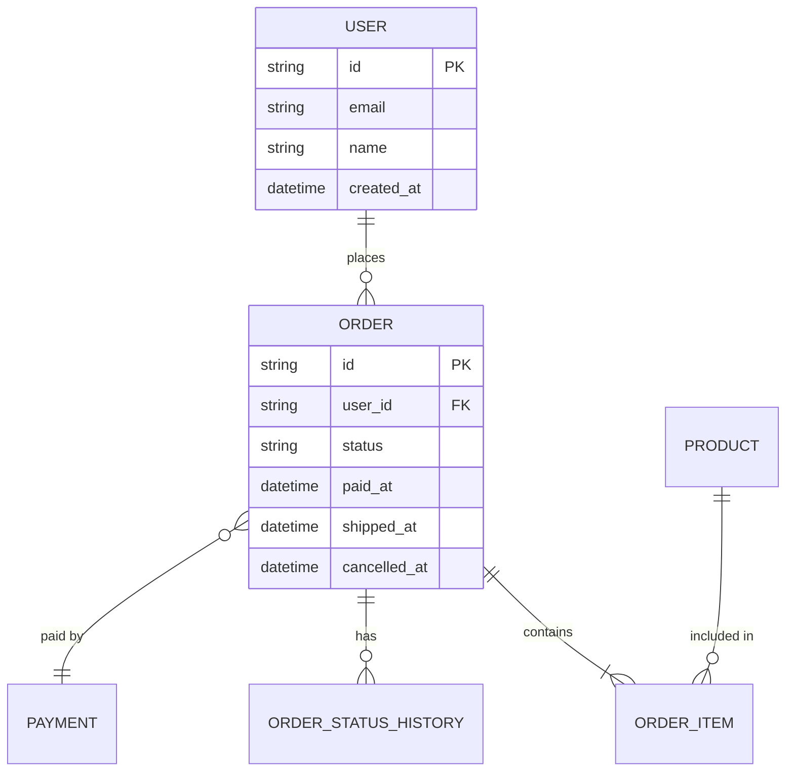

# Cómo uso IA para modernizar proyectos legacy sin romper nada


Todos hemos heredado ese proyecto. El que nadie quiere tocar. El que tiene funciones de 500 líneas, sin tests, sin documentación, y que de alguna manera funciona en producción.

Antes, refactorizar algo así era una apuesta: rezabas para no romper nada y cruzabas los dedos en cada deploy. Ahora, con IA como copiloto, el proceso es diferente. No mágico, pero sí más seguro y metódico.

Llevo un tiempo usando este enfoque en proyectos reales y quiero compartir la metodología que me ha funcionado.

---

## El error más común: empezar a refactorizar directamente

La tentación es grande. Ves ese código espagueti y quieres arreglarlo ya. Pero sin entender el negocio y sin tests, estás caminando a ciegas.

He visto (y cometido) este error: refactorizas algo que "claramente está mal", solo para descubrir que ese comportamiento raro era intencional y medio sistema dependía de él.

La IA amplifica tanto tus aciertos como tus errores. Si no sabes qué hace el código, la IA tampoco lo va a adivinar.

---

## Paso 1: Documenta el negocio primero

Antes de tocar una línea de código, necesitas entender qué hace el sistema. No el _cómo_ (eso lo ves en el código), sino el _qué_ y el _por qué_.

Si no existe documentación, créala. Y aquí la IA es tremendamente útil.

### Cómo lo hago

No empiezo por el código. Empiezo por la base de datos.

El modelo de datos te cuenta la historia del negocio mejor que cualquier código. Las tablas, las relaciones, los campos... todo eso refleja decisiones de negocio que alguien tomó en algún momento.

Le paso a la IA el esquema de la base de datos y le pido ingeniería inversa:

```
Analiza este esquema de base de datos y explícame:
1. Qué entidades de negocio representa
2. Cómo se relacionan entre sí
3. Qué reglas de negocio puedes inferir de las restricciones y campos
4. Qué flujos de negocio probables existen
5. Genera un diagrama de entidad-relación en formato Mermaid

[esquema de tablas/colecciones]
```

La IA te genera algo así:



Este diagrama lo incluyes directamente en tu documentación markdown y queda renderizado. Es oro para entender el sistema de un vistazo.

Por ejemplo, si ves una tabla `orders` con campos como `status`, `paid_at`, `shipped_at`, `cancelled_at`, ya sabes que hay un flujo de estados del pedido. Si hay una tabla `order_status_history`, sabes que necesitan auditoría de cambios de estado.

Una vez que entiendo el modelo de datos, paso al código. Le paso secciones del código y le pido que me explique la lógica de negocio:

```
Analiza este controlador y explícame:
1. Qué proceso de negocio representa
2. Qué reglas de negocio están implícitas en el código
3. Qué casos edge está manejando
4. Qué dependencias externas tiene

[código del controlador]
```

La combinación de modelo de datos + código te da una visión mucho más completa que cualquiera de los dos por separado.

La IA no siempre acierta al 100%, pero te da un punto de partida para validar con el equipo o con los stakeholders.

### El entregable

Un documento markdown con:

- Descripción general del módulo
- Flujos de negocio principales
- Reglas de negocio identificadas
- Dependencias y integraciones
- Casos especiales o excepciones

Este documento tiene doble propósito: te ayuda a ti ahora y ayuda a futuros desarrolladores después.

---

## Paso 2: Crea tests antes de refactorizar

Esta es la regla de oro: **nunca refactorices código sin tests que validen el comportamiento actual**.

No me refiero a tests unitarios perfectos con mocks de todo. Hablo de tests que capturen el comportamiento real del sistema, incluyendo la base de datos.

### Mi enfoque: tests de integración con base de datos real

En un proyecto reciente con MongoDB sin clases de dominio (queries directas por todos lados), intentar mockear era imposible. La lógica estaba tan acoplada a la estructura de los documentos que cualquier mock sería una mentira.

La solución fue crear tests de integración con una base de datos de prueba real:

```typescript
// test/integration/users/get-user-by-id.e2e-spec.ts
describe('UserController - getUserById', () => {
  let app: INestApplication
  let testDb: TestDatabase

  beforeAll(async () => {
    testDb = await TestDatabase.create()
    app = await createTestApp(testDb)
  })

  afterAll(async () => {
    await testDb.cleanup()
    await app.close()
  })

  beforeEach(async () => {
    await testDb.clear()
  })

  it('should return user when exists', async () => {
    // Arrange
    const userId = await testDb.insertUser({
      name: 'John Doe',
      email: 'john@example.com',
      status: 'active',
    })

    // Act
    const response = await request(app.getHttpServer())
      .get(`/users/${userId}`)
      .expect(200)

    // Assert
    expect(response.body).toMatchObject({
      name: 'John Doe',
      email: 'john@example.com',
      status: 'active',
    })
  })

  it('should return 404 when user does not exist', async () => {
    const fakeId = new ObjectId().toString()

    await request(app.getHttpServer()).get(`/users/${fakeId}`).expect(404)
  })
})
```

### Tests por método, no por controlador

Un consejo importante: crea un archivo de test por cada método del controlador, no un archivo gigante para todo el controlador.

¿Por qué?

- **Más fácil de depurar**: si algo falla, sabes exactamente dónde
- **Más fácil de crear incrementalmente**: puedes ir agregando tests uno a uno
- **Más fácil de mantener**: cada archivo tiene un scope claro

La estructura queda así:

```
test/
  integration/
    users/
      get-user-by-id.e2e-spec.ts
      create-user.e2e-spec.ts
      update-user.e2e-spec.ts
      delete-user.e2e-spec.ts
      list-users.e2e-spec.ts
```

### Usa la IA para generar los tests

Aquí la IA brilla. Le paso el código del método y le pido:

```
Genera tests de integración para este método.
Incluye:
- Caso exitoso
- Casos de error (not found, validación, etc.)
- Casos edge que veas en el código

Usa este formato: [ejemplo de test]
La base de datos es MongoDB, usa TestDatabase para insertar datos de prueba.
```

Revisa lo que genera, ajusta según tu contexto, y ejecútalo contra el sistema real para validar.

---

## Paso 3: Refactoriza con la red de seguridad

Ahora sí, con documentación y tests en su lugar, puedes empezar a refactorizar.

### El orden importa

No intentes refactorizar todo de una vez. Este es el orden que me ha funcionado:

**1. Extrae la capa de datos primero**

Crea repositorios bien delimitados por responsabilidad:

```typescript
// Antes: query directa en el controlador
const user = await this.db.collection('users').findOne({ _id: userId })

// Después: repositorio dedicado
const user = await this.userRepository.findById(userId)
```

Cada repositorio debe tener una única responsabilidad. Si tienes un `UserRepository` que también maneja roles y permisos, divídelo.

**2. Extrae la lógica de negocio a servicios**

Una vez que los datos están encapsulados, extrae la lógica a servicios especializados:

```typescript
// Antes: todo en el controlador
@Get(':id')
async getUser(@Param('id') id: string) {
  const user = await this.db.collection('users').findOne({ _id: id })
  if (!user) throw new NotFoundException()

  const permissions = await this.db.collection('permissions')
    .find({ userId: id }).toArray()

  return {
    ...user,
    permissions: permissions.map(p => p.name),
    isAdmin: permissions.some(p => p.name === 'admin')
  }
}

// Después: separado en servicios
@Get(':id')
async getUser(@Param('id') id: string) {
  return this.userFacade.getUserWithPermissions(id)
}
```

**3. Convierte el controlador en una fachada**

El controlador (o el servicio principal si usas ese patrón) se convierte en un orquestador que delega a servicios especializados:

```typescript
// user.facade.ts
@Injectable()
export class UserFacade {
  constructor(
    private readonly userService: UserService,
    private readonly permissionService: PermissionService,
    private readonly notificationService: NotificationService
  ) {}

  async getUserWithPermissions(id: string): Promise<UserWithPermissionsDto> {
    const user = await this.userService.findById(id)
    const permissions = await this.permissionService.getForUser(id)

    return {
      ...user,
      permissions: permissions.map((p) => p.name),
      isAdmin: permissions.some((p) => p.name === 'admin'),
    }
  }
}
```

Uso el sufijo `Facade` para dejar claro que es solo un orquestador, no donde vive la lógica real.

### Actualiza los tests conforme agregas dependencias

Cada vez que extraes una dependencia nueva, tienes que agregarla a los tests. Un tip: crea un helper que agrupe la configuración del módulo de test:

```typescript
// test/helpers/create-test-module.ts
export async function createUserTestModule(testDb: TestDatabase) {
  return Test.createTestingModule({
    imports: [
      /* imports comunes */
    ],
    controllers: [UserController],
    providers: [
      UserFacade,
      UserService,
      PermissionService,
      UserRepository,
      PermissionRepository,
      { provide: 'DATABASE', useValue: testDb.getConnection() },
    ],
  }).compile()
}
```

Así cuando agregas una dependencia nueva, solo la agregas en un lugar.

---

## Paso 4: Refactoriza los tests

Una vez que el código está limpio y todo funciona, toca limpiar los tests.

Durante la refactorización, los tests probablemente quedaron con código duplicado, helpers improvisados, y estructuras inconsistentes. Ahora es momento de ordenarlos.

**Importante**: refactoriza los tests sin cambiar su funcionalidad. Los tests deben seguir validando exactamente lo mismo, solo que con código más limpio.

Esto incluye:

- Extraer helpers comunes
- Unificar la estructura de arrange/act/assert
- Mejorar los nombres de los tests
- Eliminar código duplicado

---

## Paso 5: Documenta los resultados

El último paso es crear un archivo markdown con el resumen de la cobertura de tests:

```markdown
# Tests del módulo Users

## Cobertura

| Endpoint          | Casos cubiertos | Estado |
| ----------------- | --------------- | ------ |
| GET /users/:id    | 5               | ✅     |
| POST /users       | 8               | ✅     |
| PUT /users/:id    | 6               | ✅     |
| DELETE /users/:id | 4               | ✅     |

## Casos de negocio validados

- Creación de usuario con validación de email único
- Asignación automática de permisos por rol
- Soft delete con preservación de historial
- ...

## Cómo ejecutar

\`\`\`bash
npm run test:e2e -- --grep "UserController"
\`\`\`
```

Este documento sirve como contrato vivo del comportamiento del sistema.

---

## Consideraciones adicionales

### No confíes ciegamente en la IA

La IA es un copiloto, no el piloto. Revisa todo lo que genera, especialmente:

- Lógica de negocio que pueda malinterpretar
- Edge cases que no detecte
- Código que "funciona" pero no sigue las convenciones del proyecto

### Haz commits pequeños y frecuentes

Cada paso debería ser un commit:

- "docs: documentar flujo de creación de usuarios"
- "test: agregar tests de integración para getUserById"
- "refactor: extraer UserRepository"
- "refactor: extraer PermissionService"

Si algo sale mal, puedes revertir sin perder días de trabajo.

### Mantén el sistema funcionando en todo momento

La regla más importante: después de cada cambio, los tests deben pasar y el sistema debe funcionar. Si rompes algo, arréglalo antes de continuar.

Esto significa que puedes hacer deploy en cualquier momento del proceso. No estás en un "estado roto" durante semanas.

### Comunica el progreso

Si trabajas en equipo, mantén a todos informados. Un refactor silencioso genera conflictos de merge y frustración.

Un mensaje simple en Slack basta:

> "Estoy refactorizando el módulo de usuarios. Voy a extraer los repositorios hoy. Si necesitan hacer cambios ahí, avísenme para coordinar."

### No busques la perfección

El objetivo no es código perfecto, es código mejor. Si el código legacy era un 2/10 y lo dejas en 7/10, es un éxito enorme.

Siempre puedes seguir mejorando después, pero ahora tienes tests y documentación que hacen eso mucho más seguro.

---

## Resumen del proceso

1. **Documenta el negocio** — Usa IA para entender qué hace el sistema y crea documentación
2. **Crea tests de integración** — Captura el comportamiento real antes de tocar nada
3. **Refactoriza en capas** — Datos primero, luego lógica, luego fachada
4. **Limpia los tests** — Una vez que todo funciona, ordena el código de pruebas
5. **Documenta los resultados** — Deja un resumen de qué está cubierto

La IA acelera cada uno de estos pasos, pero la metodología es lo que te da seguridad. Sin tests, estás adivinando. Sin documentación, el siguiente desarrollador (o tú en 6 meses) empezará de cero.

El código legacy no tiene que dar miedo. Con el enfoque correcto y las herramientas adecuadas, modernizarlo es solo cuestión de tiempo y disciplina.
